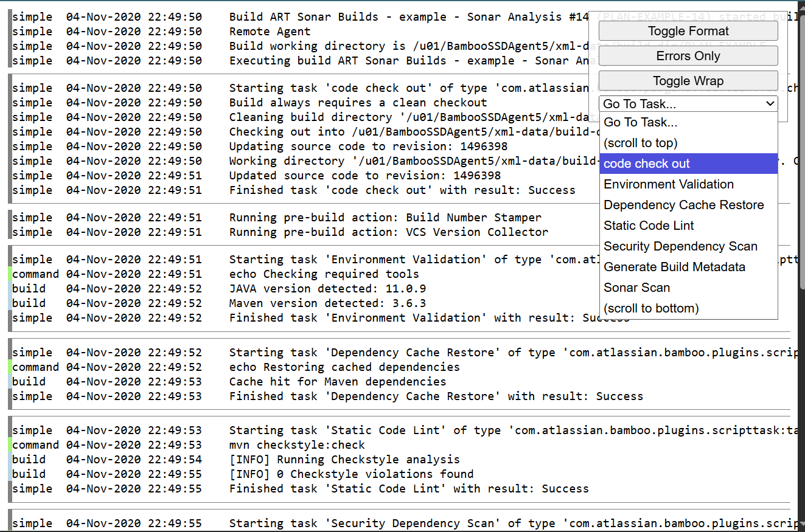

# Bamboo Logs Formatter

A userscript that enhances the readability and navigation of Bamboo build logs by applying custom formatting and providing additional features.

## Features

- **Toggling**: Allows users to enable or disable the log formatting on demand.
- **Formatting**: Applies custom styles to enhance the visual presentation of logs.
- **Task Navigation**: Provides a dropdown to quickly navigate to specific tasks within the logs.
- **Error-Only View**: Offers an option to filter and view only error messages.
- **Wrapping**: Enables or disables text wrapping for better readability.

## Installation

1. Install a userscript manager:
    - [Tampermonkey](https://www.tampermonkey.net/)
    - or [Greasemonkey](https://www.greasespot.net/).
2. Click the button to install the userscript:

3. Update the `@match` metadata in the userscript to match the URL pattern of your Bamboo logs page.

You can also create the userscript manually by copying the code from `Bamboo Logs Formatter-2026-03-06.user.js` and pasting it into a new script in your userscript manager.

## Screenshot

## Development

To set up a development environment, follow these steps:

1. Clone the repository
2. Open `test.html` in your browser to test the userscript without needing to install it in a userscript manager.
3. Make changes to `script.js` and refresh `test.html` to see the updates.

You can also use a serving tool like `live-server` to serve the files
and enable hot-reloading for a smoother development experience.

This script consists of three main parts:

- **Panel**: A class which manages the user interface elements, such as the toggle button, task dropdown, and error filter.
- **Logs renderer**: A class which initially transforms the original `<pre>` log content into multiple `<pre>` elements (one per line) and applies styles so that Panel can manipulate them.
- **Styles**: A set of CSS rules that define the appearance of the formatted logs and the user interface elements. They are placed at the end of the file to make reviewing the code easier, as they are not relevant to the logic of the script (and for security reasons).
- and a small "main" function that runs all of them.
